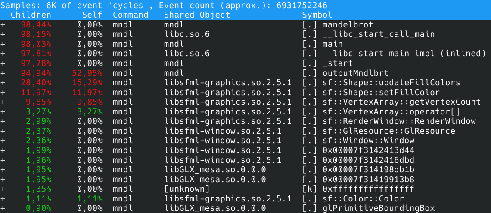
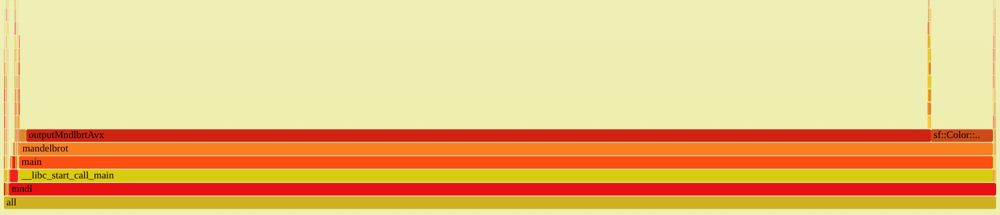
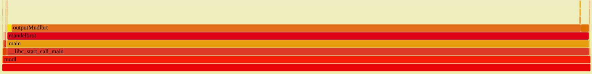
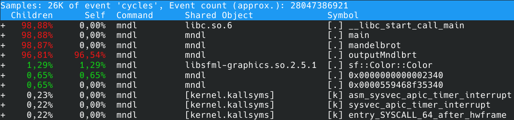

# Mandelbrot
As part of this project, I wrote code that shows the Mandelbrot factorial set. You can press:
- <kbd>&#x2191;</kbd> to raise the picture;
- <kbd>&#x2193;</kbd> to lower the picture;
- <kbd>&#8594;</kbd> to move the picture to the right;
- <kbd>&#8592;</kbd> to move the picture to the left;
- <kbd>F1</kbd> to zoom in;
- <kbd>F2</kbd> to zoom out.

On your device, you can reproduce the picture below:

To do this, you need to compile the project by typing make in the console when you clone the repository to your computer. If you want to remove the __optimization flags__, then remove the corresponding flag in the `makefile`; to disable __rendering__ remove the -DDRAW flag; to disable __AVX2__ optimization, remove the -DAVX_ON flag. Initially, the optimization, rendering and AVX2 flags are __enabled__.

## AVX or not AVX... 

|   in FPS    |       AVX2        |  Without AVX2  |
| :------:    | :---------------: | :------------: | 
|   none      |        9          |        4       |
|    -O3      |       15          |       10       |
|   -Ofast    |       15          |       10       |

Hmm, but this is not the acceleration that was expected. Let's go figure out what the error is. To do this, I used perf, as well as the FlameGraph graphical interpreter.

SFML libraries take up about 90%! Terrible measurements. It turns out that I haven't completely disabled SFML instructions in my loop. Let's fix this and re-measure the speed of the algorithm with and without AVX2 optimization. By the way, I specifically switched to a different calculation algorithm: I began to go not by an imaginary physical coordinate system (this is the one for which the BORDER variable is needed), but by pixels on the screen (WINDOW_SIZE_X and WINDOW_SIZE_Y). This allows you to speed up the algorithm, since now I am updating only the image, and not redrawing the window pixel by pixel.

With AVX2:

Without AVX2:

Accuracy of measurements:

See, the parts from the SFML library now take up less than 1.5% of the total cycle work, which is a negligible error, so the data in the table below is now correct.

|   in FPS    |       AVX2        |  Without AVX2  |
| :------:    | :---------------: | :------------: | 
|   none      |       16          |        7       |
|    -O1      |       65          |       19       |
|    -O2      |       65          |       19       |
|    -O3      |       64          |       19       |
|   -Ofast    |       66          |       21       |

Conclusion: of course, you need to use AVX2 optimization :)
